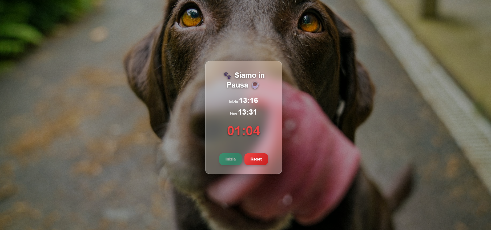

# Siamo in Pausa – Break Timer Web Application

Applicazione web front-end per la gestione di una pausa di 15 minuti tramite countdown dinamico.
L’interfaccia è semplice e completamente responsive, con indicazione visiva del tempo rimanente tramite cambio colore.

*Progetto realizzato durante il Corso Front End – 2025.*

---

## Funzionalità

- Timer di pausa da 15 minuti con calcolo automatico di inizio e fine
- Countdown aggiornato in tempo reale
- Indicatore visivo del tempo rimanente:
  - verde: più di 10 minuti
  - giallo: tra 10 e 3 minuti
  - rosso: meno di 3 minuti
- Layout responsive per desktop e mobile

---

## 📸 Screenshot 

---

## Tecnologie Utilizzate

- HTML5
- CSS3
- JavaScript
- Bootstrap
- VS Code

---

## 👩‍💻 Autrice 
**Chiara Tanzi**